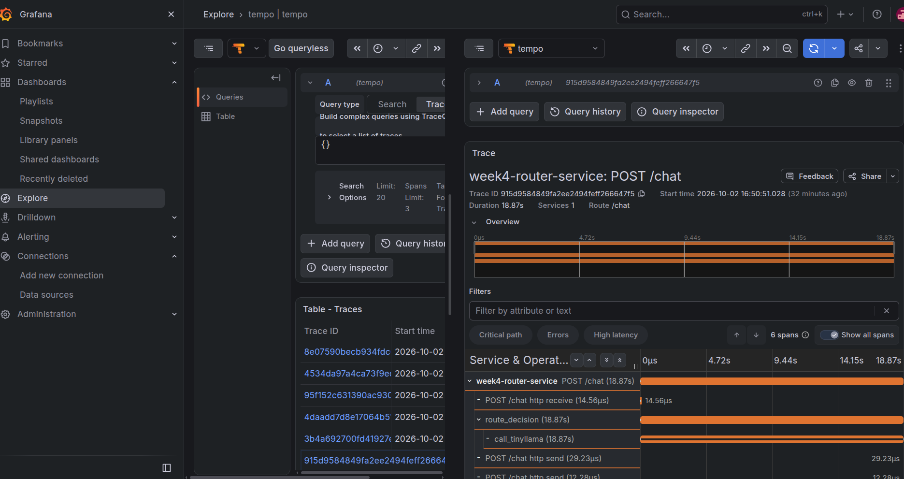
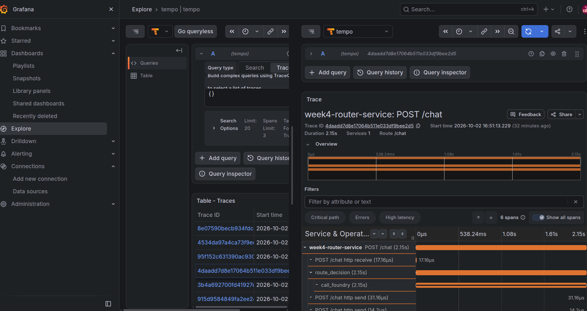
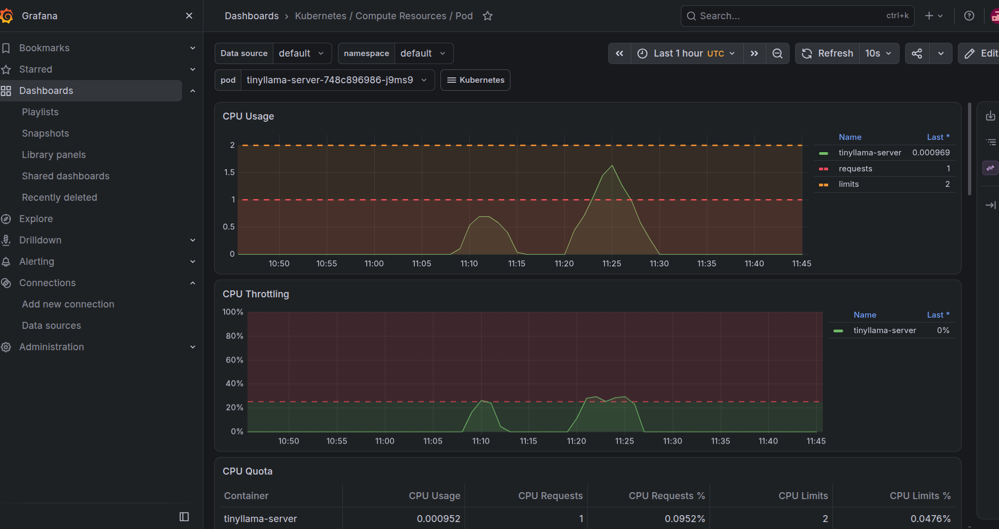
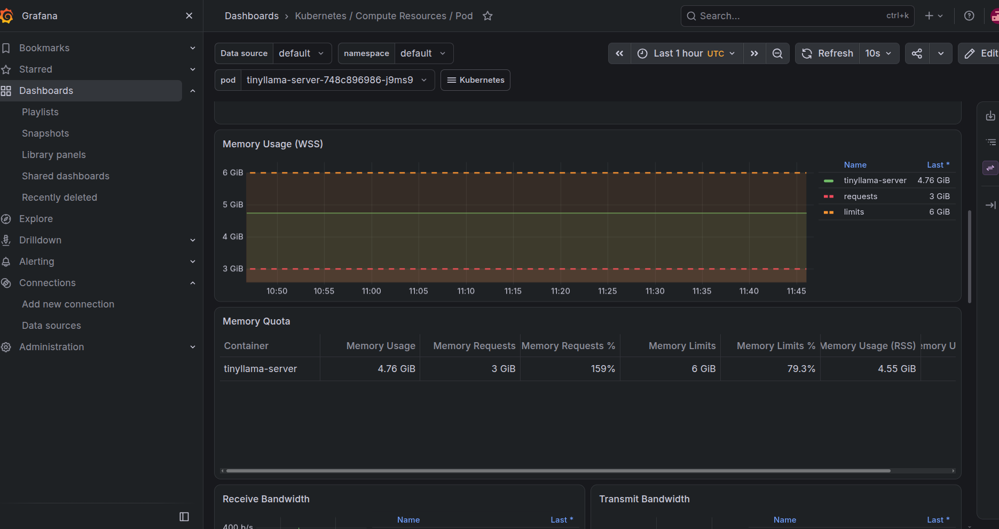

# Week 4: AKS + Foundry Router, Instrumented, and Measured

**Goal:** Build a small routing service between a self-hosted model on AKS and a managed model on Azure AI Foundry, instrument it with an observability stack, and measure whether the routing actually pays off in cost, latency and quality.

**Status:** ✅ done (2026-10-02)

## Summary

A static length-based router sends short prompts (100 characters or fewer) to TinyLlama-1.1B on AKS and longer prompts to Mistral Large 3 on Azure AI Foundry. I instrumented it with OpenTelemetry and ran Prometheus, Grafana and Tempo inside the cluster. Then I measured it.

**The result went against the premise.** The router was meant to save money by keeping easy prompts on a cheap local model. On this setup the small model on CPU was slower, worse and more expensive per call than the managed large model. Prompt length also turned out to be a poor proxy for difficulty: the "short" prompts were factual Kubernetes questions that TinyLlama got wrong.

| target | quality (1-5) | p50 latency | p95 latency | cost per call |
|---|---|---|---|---|
| Foundry, Mistral Large 3 | **4.7** | 3.96s | 6.81s | about $0.00025 |
| Router (length threshold) | 3.3 | 11.62s | 19.24s | mixed |
| TinyLlama-1.1B on AKS (CPU) | 2.0 | 20.74s | 23.36s | about $0.001-0.0014 at full utilization (estimate) |

## Architecture

- **Cluster:** AKS `ai-infra-sprint-aks` (Southeast Asia), a `cpupool` of 2x `Standard_D2s_v5` and a `userpool` of 1x `Standard_D4s_v5`.
- **TinyLlama service:** FastAPI + transformers, serving `TinyLlama/TinyLlama-1.1B-Chat-v1.0`, weights baked into a 5.9 GB image pushed to Azure Container Registry. Pod resources: CPU request 1 / limit 2, memory request 3 GiB / limit 6 GiB.
- **Router service:** FastAPI. Prompts of 100 characters or fewer go to TinyLlama, longer ones to Foundry (Mistral Large 3, Models API). It exposes `/chat` with `prompt` and `max_new_tokens`.
- **Observability:** `kube-prometheus-stack` (Prometheus + Grafana) and Tempo in the `observability` namespace. The router emits OpenTelemetry spans: `route_decision`, then `call_tinyllama` or `call_foundry`.
- **Why this stack:** I deployed Prometheus/Grafana/Tempo inside AKS rather than sending traces to an observability stack running outside Azure, which the cluster couldn't reach. It also gave me a second stack to learn.

## Method

- A script (`benchmark/compare.py`) sent 10 prompts to three targets: the router, TinyLlama directly, and Foundry directly. 5 prompts were short (all under the router's 100-character threshold) and 5 were long (all over it): root-cause analysis, an incident summary, JSON extraction, a PromQL query, and a routing-strategy comparison.
- `max_new_tokens` was 200 for every call. TinyLlama sampled with temperature 0.7.
- Each prompt was run once per target. A second run isolated TinyLlama only, after raising its CPU limit (see below).
- Quality was scored 1-5 per response, with a one-line reason each (`benchmark/comparison-scored.csv`). **Scoring was done by Claude, as a single rater**: 5 means correct and complete, 1 means wrong or off-task. Responses cut off by the token cap were marked down only where needed content was missing.
- Foundry price used: $0.50 per 1M input tokens and $1.50 per 1M output tokens (Global Standard deployment, from third-party pricing trackers, not verified against my portal).

## Results

### Latency, quality and cost

| target | calls | errors | p50 | p95 | quality (all) | quality (short / long) |
|---|---|---|---|---|---|---|
| Foundry | 10 | 0 | 3.96s | 6.81s | 4.7 | 5.0 / 4.4 |
| Router | 10 | 0 | 11.62s | 19.24s | 3.3 | 2.4 / 4.2 |
| TinyLlama (2-core limit) | 10 | 0 | 20.74s | 23.36s | 2.0 | 2.4 / 1.6 |

- Foundry cost for the 10 calls was about $0.0025 in total, roughly $0.00025 per call. Six of the ten answers hit the 200-token cap, so this reflects capped output.
- The router sent all five short prompts to TinyLlama and all five long ones to Foundry (confirmed in the `backend` column). Router short-prompt latency ran 8.8-19.2s. Router long-prompt latency ran 1.7-3.2s, plus one 14.4s outlier I did not investigate.

### What TinyLlama got wrong

These were the "easy" short prompts. It described exit code 137 without mentioning SIGKILL or OOM. It said a CrashLoopBackOff is a container failing to restart (it is repeated crashing with backoff). It swapped the definitions of liveness and readiness probes. It misread p99 latency as a count of active requests. On the long prompts it invented a PromQL function (`response_over_time`), produced malformed JSON when asked to extract three fields, and wrote an article introduction instead of the requested comparison. It was only solid on naming Prometheus metric types.

### Cost reasoning

TinyLlama's node cost is fixed. I assumed about $0.20 per hour for the `D4s_v5` node, which I did not check against Cost analysis. At 19-24 seconds per call, a single stream handles roughly 150-190 calls per hour. At full utilization that works out to about $0.0011-0.0014 per call, against about $0.00025 on Foundry, so roughly 4-5x more expensive and several times slower. The node would need to be much cheaper, or the model much faster, before self-hosting wins at this scale.

### Observability findings

- **Traces:** a short prompt took 18.87s, almost all inside `call_tinyllama`. A long prompt took 2.15s, almost all inside `call_foundry`. The router's own overhead (HTTP receive, `route_decision` logic) is microseconds. The routing decision itself is free. What costs is the backend it picks.
- **CPU:** the pod's CPU showed two bursts matching my two test runs, peaking at about 0.7 and 1.6 cores. Throttling reached about 25-30% in the bursts at the 2-core limit.
- **Memory:** flat at about 4.76 GiB working set, which is 79% of the 6 GiB limit but 159% of the 3 GiB request. The pod is under-requested, so the scheduler thinks it needs less memory than it does.
- The Grafana dashboard displays UTC.

### CPU limit experiment (2 to 4 cores)

I raised the TinyLlama CPU limit from 2 to 4 cores to test whether throttling explained the slowness.

- **Apparent result:** p50 rose from 20.74s to 29.79s.
- **What actually happened:** decode speed was about the same, roughly 4-5 words per second in both runs. Six of ten calls in the second run reached the 200-token cap and landed at about 30s. Which calls produce long answers is a sampling effect, so total latency is not a fair comparison between runs.
- **Conclusion:** raising the limit did not change decode speed. About 6 tokens per second (my estimate from words per second) looks like the ceiling on this node. I did not test why. A plausible guess is that CPU decoding is limited by memory bandwidth, and the node's 4 vCPUs are really 2 physical cores. The node was idle at about 2% CPU when I checked afterwards, so noisy neighbours seem unlikely, though I could not see its state during the run.
- **Lesson:** total latency alone misled here. At first glance the 4-core run looked slower, but the first run's long answers (54-98 words) were not capped, so the two runs were not comparable. Tokens per second is the right basis for comparing runs.

## Issues hit this week

- TinyLlama was OOMKilled at lower memory limits. I fixed it by raising the limit to 6Gi instead of rebuilding with bf16.
- `apply_chat_template` returned a `BatchEncoding` where a bare tensor was expected. Fixed with `return_dict=True` and `**inputs`.
- Foundry returned a 400 until I added the `model` field the serverless Models API requires.

## Caveats

- One run per prompt per target. Latency varies with how long the model chooses to write, so the numbers are directional, not statistical.
- Quality scores are one rater's judgment (Claude), on 10 prompts.
- TinyLlama ran on CPU. A GPU would change both its latency and its cost.
- The $0.20 per hour node cost is an assumption, and the Foundry prices come from third-party trackers.
- The 200-token cap truncated 6 of 10 Foundry answers.

## What I would do differently

1. **Route by task type or with a small classifier, not by length.** The length threshold sent factual questions to the weakest model.
2. **Compare tokens per second, not total latency,** and fix temperature at 0 for benchmarks.
3. **Repeat each prompt several times** and report medians.
4. **Test a GPU node** for the small model before concluding that self-hosting loses on cost. At this scale a managed endpoint is the better default.
5. **Set memory requests close to real usage.**

## Artifacts

- Comparison script: `benchmark/compare.py` (options `ONLY=<target>` and `LABEL=<tag>`)
- Raw results: `benchmark/comparison-20261002-1655.csv` (first run), `benchmark/comparison-20261002-1809-cpu4.csv` (4-core run)
- Scored results: `benchmark/comparison-scored.csv`
- Screenshots (`images/`): `week4-trace-tinyllama-short.png`, `week4-trace-foundry-long.png`, `week4-pod-cpu.png`, `week4-pod-memory.png`
- Router and TinyLlama code: `week4-aks-foundry-router/`
